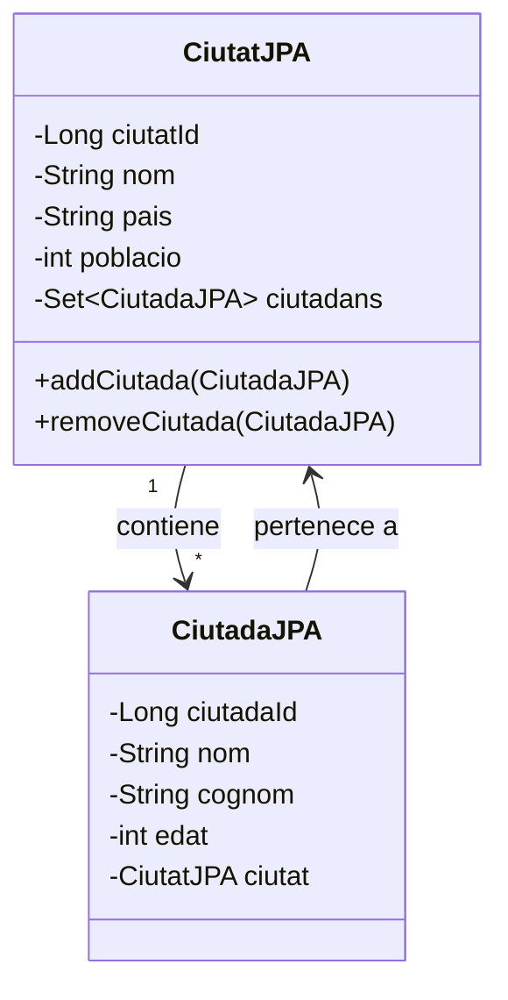
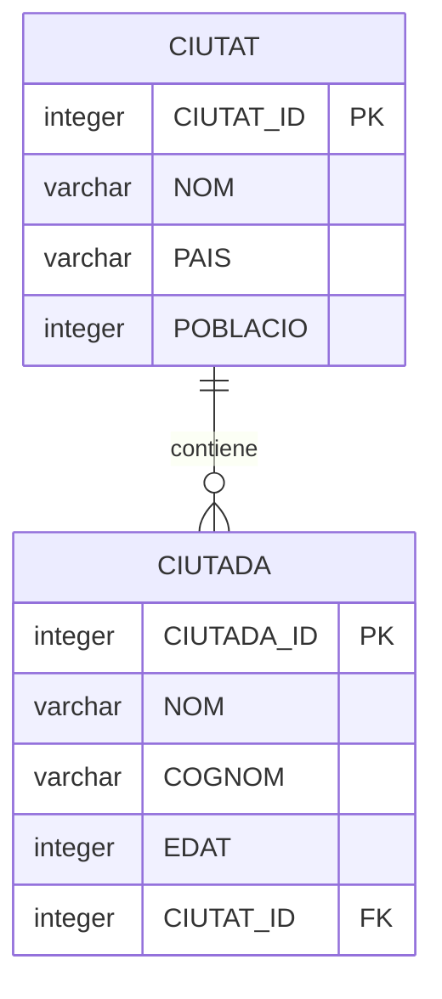

## Diagrama de Classes

```mermaid
classDiagram
    class CiutatJPA {
        -Long ciutatId
        -String nom
        -String pais
        -int poblacio
        -Set~CiutadaJPA~ ciutadans
        +addCiutada(CiutadaJPA)
        +removeCiutada(CiutadaJPA)
    }
    
    class CiutadaJPA {
        -Long ciutadaId
        -String nom
        -String cognom
        -int edat
        -CiutatJPA ciutat
    }
    
    CiutatJPA "1" --> "*" CiutadaJPA : contiene
    CiutadaJPA --> CiutatJPA : pertenece a
```

## Diagrama de BD

```mermaid
erDiagram
    CIUTAT ||--o{ CIUTADA : "contiene"
    CIUTAT {
        integer CIUTAT_ID PK
        varchar NOM
        varchar PAIS
        integer POBLACIO
    }
    CIUTADA {
        integer CIUTADA_ID PK
        varchar NOM
        varchar COGNOM
        integer EDAT
        integer CIUTAT_ID FK
    }
```